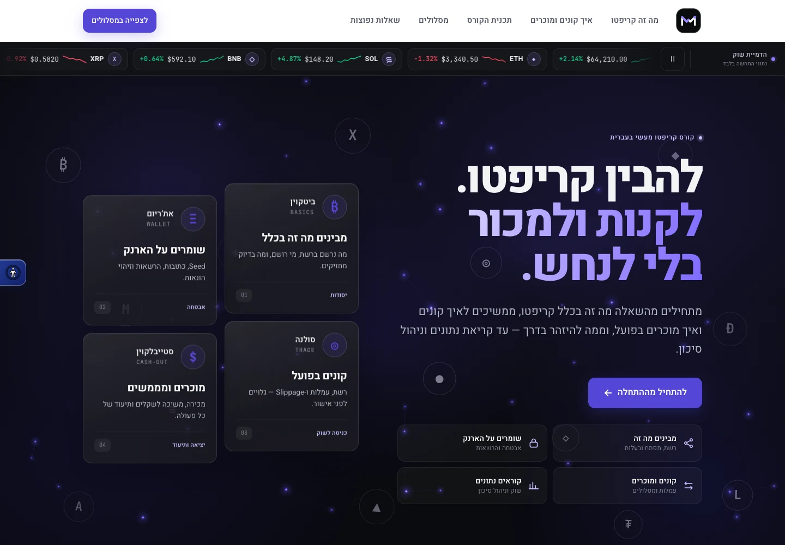
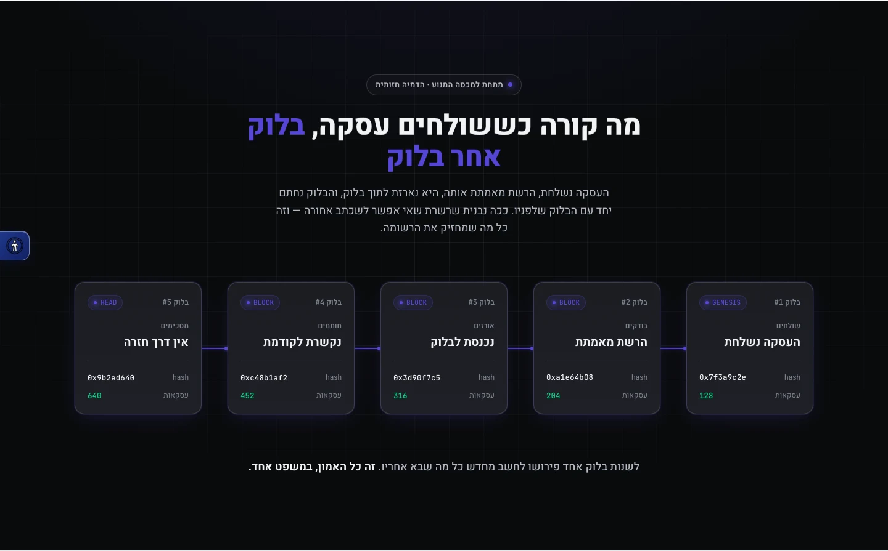
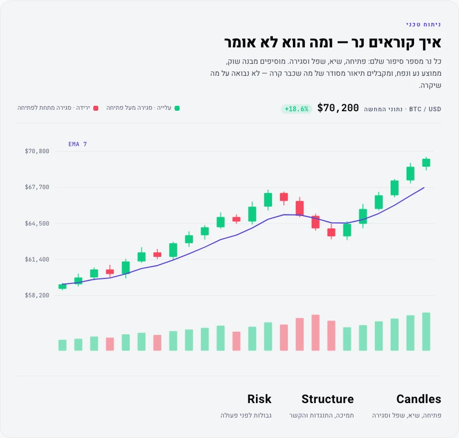
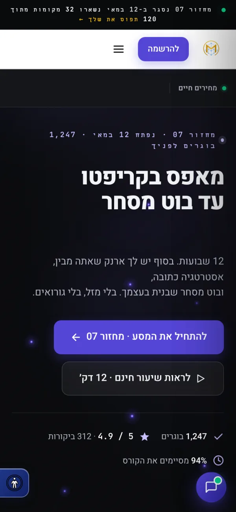

# MasterCrypto

> **A Hebrew, right-to-left landing page for a paid cryptocurrency course — one static HTML file, no build step, no framework.**

**Live:** [crypto-course-landing-tau.vercel.app](https://crypto-course-landing-tau.vercel.app)

<p align="center">
  
</p>

`HTML` · `CSS` · `vanilla JS` · `GSAP 3.12.5` · `ScrollTrigger` · `Lenis 1.1.14` · `Vercel`

---

## Shipping the entire product as one HTML file

The deployed product is a single `index.html` — 312,073 bytes, 7,320 lines, inline `<style>` and inline vanilla JavaScript. The repo tracks five files total: `index.html`, `logo.png`, `vercel.json`, `.gitignore`, `README.md`. No `package.json`, no bundler, no framework, no CI workflow. Vercel serves the committed file as a static asset; nothing sits between the committed bytes and the served bytes.

## Isolating numerals so digits survive the RTL flow

Hebrew runs right-to-left; Latin digits, currency and percentages run left-to-right. Dropped unprotected into an RTL paragraph, a string like `+18.6%` visually reorders. Every numeral goes in a `.num` span:

```css
.num, .mono {
  font-family: var(--font-mono);
  font-feature-settings: 'tnum' 1;
  direction: ltr;
  unicode-bidi: isolate;
}
```

`unicode-bidi: isolate` pins the run so surrounding Hebrew cannot reorder it; `tnum` keeps a live price ticker from jittering as digit widths change. The candlestick time axis deliberately runs left-to-right *against* the page direction — the convention financial charts are read in.

## Degrading five motion engines to a static page

Five namespaced, self-contained engines: `mc-net` (hero lattice canvas), `mc-coincard` (3D tilt glass cards), `mc-chain` (blockchain showcase), `mc-candles` (draw-on-scroll candlestick), `mc-ticker` (RTL marquee).

Each obeys one contract — GPU-only transforms, `requestAnimationFrame` loops paused when the section leaves the viewport (`IntersectionObserver`) or the tab is hidden (`visibilitychange`), and a fully-formed static fallback.

Reveal animations sit behind a `gsap-pending` class with a 1.6s safety timeout that lifts the gate if `window.gsap` never appears: a CDN failure costs the animation, never the content.

A reduce-motion bridge mirrors *both* the OS `prefers-reduced-motion` setting and the in-page accessibility toggle into shared flags (`html.mc-reduce`, `window.__mcReduceMotion`) and an `mc-reduce-change` event. Engines subscribe to the bridge, not the media query alone — otherwise the in-page toggle would leave canvas animation running.

## Constraining third-party scripts with a CSP allowlist

`vercel.json` sets a Content-Security-Policy response header whose `script-src` allows `'self'`, `'unsafe-inline'` — the page's JavaScript is inline, so the policy has to permit it — and three named hosts, with `object-src 'none'` and `base-uri 'self'`. The allowlist constrains which third-party origins can serve script, not what inline script may run. The page loads four external scripts. The three CDN libraries — GSAP, ScrollTrigger, Lenis — are Subresource-Integrity pinned with `sha384` hashes, so a tampered CDN response fails closed instead of executing; the fourth, the accessibility widget, is served from its own allowlisted host without a pin.

Accessibility ships as a shared widget loaded by script tag rather than a per-site panel, so it is maintained in one place across projects. The page carries 104 `aria-` attributes and a `.skip-link` to `#main-content`.

## Replacing named reviews and credentials with placeholders

Commit `b358e56` removed invented reviews and instructor credentials and moved the demo identity and contact details to placeholders (`ישראל ישראלי`, `050-000-0000`, `wa.me/972500000000`). The aggregate figures still on the page — graduate counts, rating, completion rate, years taught — are unverified demo copy, not measured results. Design holds a single accent, `--purple: #5546D6`; the `#4400aa` in the codebase is only the high-contrast accessibility override, not a second brand color.

## How it was verified

- **2026-08-31** (first checked 2026-08-15) — the live URL returns bytes identical to the committed `index.html`: SHA-256 `e56351ec…9eb6`, 312,073 bytes on both sides.
- The CSP header is present on the live response (`server: Vercel`) and matches `vercel.json`.
- Sections in document order: chain showcase, curriculum, instructor, pricing, testimonials, FAQ, enroll.

## Screenshots

<p align="center">
  
</p>

<p align="center">
  
</p>

<p align="center">
  
</p>

---

Source is private. Built by [@shear559](https://github.com/shear559).
